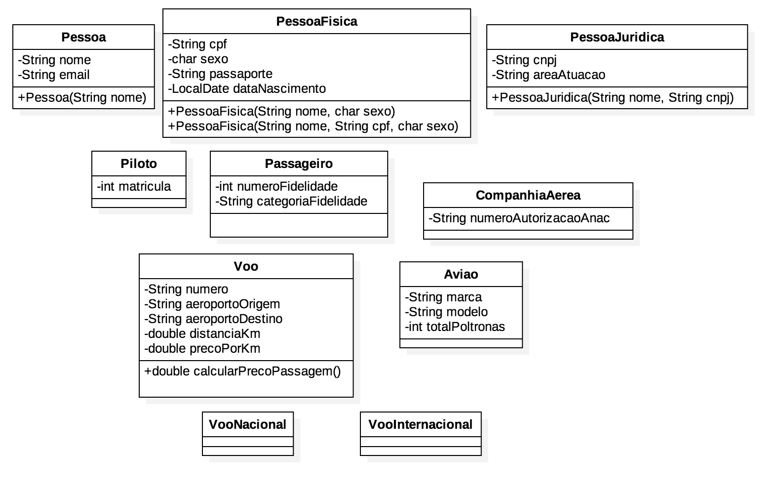

= Exercícios: encapsulamento, herança, todo-parte: agregação/composição, polimorfismo

== 1. Implemente o projeto do diagrama de classes a seguir no NetBeans. 

Identique quais tipos de relacionamentos deve existir entre as classes, considerando alguns requisitos como: 

- um avião terá apenas um piloto;
- um piloto não pode ser passageiro, nem vice-versa.

O projeto deve utilizar encapsulamento e implementar os relacionamentos seguindo as cardinalidades e direção das associações definidas por você. Implemente os construtores indicados evitando duplicação de código. 

O método `calcularPrecoPassagem()` da classe `Voo` deve calcular o preço que um próximo passageiro pagará na passagem aérea. Tal preço deve ser o `precoPorKm` multiplicado pela `distanciaKm`. Para cada tipo de voo, o preço é calculado de forma diferente.

- *voos nacionais*: o preço é reduzido em: R$ 0,10 multiplicado pelo total de passageiros no voo. Isto quer dizer que os primeiros a comprar passagem, enquanto o voo tem muitos lugares vazios, terão um menor desconto. As pessoas que comprarem passagem quando o voo estiver quase cheio terão um maior desconto. Isto quer dizer que os últimos passageiros a comprar terão maior desconto. Este cálculo se explica pelo fato de que é mais barato para a companhia aérea vender poltronas remanescentes a um preço mais baixo do que voar sem a lotação total do avião.
- *voos internacionais*: a companhia resolveu adotar uma política de preços mais lucrativa: o preço continua sendo calculado com base na distância do voo, acrescido de R$ 0,10 multiplicado pelo total de poltronas vazias. Isto quer dizer que os primeiros passageiros a comprar terão maior acréscimo.

== 2. Faça uma cópia da pasta do projeto anterior e altere para permitir que um piloto possa ser passageiro e vice-versa.

Indique o nome de relacionamento utilizado para tal implementação.

== 3. Explique qual o conceito utilizado para implementar o cálculo do preço da passagem.

== 4. Se precisarmos armazenar os dados de cada passagem vendida (como qual o passageiro comprou e quanto custou), que alterações precisamos fazer no projeto para implementar isto?

Indique que tipo de relacionamento deve ser criado e qual a cardinalidade do mesmo.